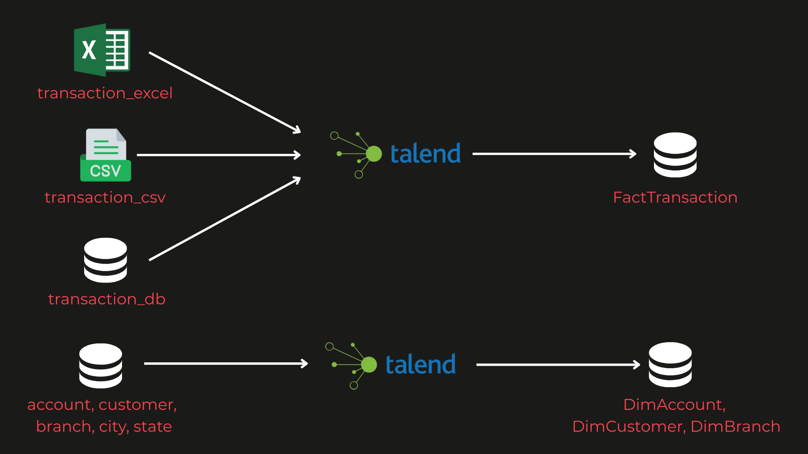

# 🏦 Data Engineer Final Task - ID/X Partners

## 📌 Project Overview
This project is part of the **Data Engineer Virtual Internship Experience (ID/X Partners)**.  
The main goal is to build a **Data Warehouse (DWH)**, implement **ETL pipelines** with **Talend**, and create **Stored Procedures** to help a banking client integrate and analyze data faster.

**Key Deliverables:**
- Dimensional Data Warehouse (Star Schema)
- ETL pipelines (Talend Open Studio) from multi-source data (Excel, CSV, SQL Server)
- Stored Procedures for reporting (DailyTransaction & BalancePerCustomer)
- Final presentation slide deck

---

## 🏗️ Architecture
